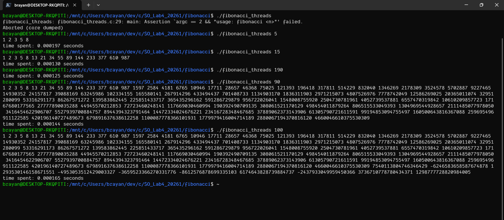

# Laboratorio #4 Sistemas operativos 

## Integrantes 

> Kelly Julieth Arango Henao
> kjulieth.arangoh@udea.edu.co
> 1036657098


> Brayan Stiven Jaraba Alvarez
> b.jaraba@udea.edu.co
> 1032178608
---
## Integracion numerica $\pi$

---

## Sucecion de fibonacci
Para este laboratorio se implemento una version de la sucecion de fibonacci utilizando hilos. Esta implementacion tiene una ligera diferencia con la mas comun. En esta version de la sucesion de fibonacci, se tomaron los siguentes casos bases

$$
f(-2) = 0 \text{, y }
f(-1) = 1
$$

Y para el resto de los casos

$$
f(n) = f(n-1) +f(n-2) \text{ para } n \ge 0
$$

Por lo tanto 

$$
f(0) = 1 \text{, y } f(1) = 2
$$

### Explicacion de la implementacion del codigo

- **Funcion que ejecuta el hilo hijo**. Esta funcion recibira como parametro una estructura que contendra el valor `n` pasado por consola por el usuario mas un array de tamaño n en donde si iran almacenando las sumas de la sucesión. Luego se definiran los casos bases, es decir para cuando `n = 0` y `n = 1`, el para los cuales los valores son 1 y 2 respectivamente. y por ultimo, se iterara a traves del array para donde el valor del indice `i` del array sera la suma del anterior y el segundo anterior. Como se ve en el siguiente fragmento de codigo

```c
typedef struct {
  int n;
  long long  *arr;
} fibonacci_args;

void *calculate_fibonacci(void *args) {
  fibonacci_args *fargs = (fibonacci_args *)args;
  int n = fargs->n;
  long long  *arr = fargs->arr;

  arr[0] = 1;
  arr[1] = 2;

  for (int i = 2; i < n; i ++ ) {
    arr[i] = arr[i - 1] + arr[i - 2];
  }
  return 0;
}
```

- **Funcion `main`, hilo padre**. En esta parte del codigo recibimos los argumentos pasados por consola (el valor de `n`), se comprueba que sean correctos, se crea el espacio de memoria para el array de tamaño `n` y se crea una instancia de la estructura usando n y el puntero del array. Luego se crea la rama usando `pthread_create`, luego esperamos que el hilo termine usando la funcion `pthread_join` se calcula el tiempo gastado, en caso de que el `n` se menor o igual a 100 imprimimos cuada uno de los elementos del array, y finalmente liberamos el puntero al array. Como se puede ver en el siguiente fragmento de codigo.

```c

int main(int argc, char *argv[]) {
  clock_t start = clock();

  assert(argc == 2 && "usage: fibonacci <n>");
  pthread_t tread_id;

  int n = atoi(argv[1]);
  long long  *arr = malloc(sizeof(long long) * n);
  assert(arr != NULL);
  fibonacci_args fargs = {n, arr};

  pthread_create(&tread_id, NULL, calculate_fibonacci, &fargs);
  pthread_join(tread_id, NULL);

  clock_t end = clock();
  double time_spent = (double)(end - start) / CLOCKS_PER_SEC;

  if (n <= 100) {
    for (int i = 0; i < n; i ++ ) {
      printf("%lld ", arr[i]);
    }
    printf("\n");
  }
  printf("time spent: %f seconds\n", time_spent);
  free(arr);
}
```

### Problemas encontrados durante esta implementacion

Tipo de dato `int`. Inicialmente en la implementacion utilizamos el tipo de dato int para seaprar la memoria para la lista de numeros de la sucesion de fibonacci. Pero como la sucesion de fibonacci crece tan rapido para numeros grandes de `n` empezaban a salir numeros negativos. Investigamos y nos dimos cuenta que se debia al tipo de dato `int` que es demaciado pequeño para este tipo de algoritmos. Asi que la solucion fue utilizar el tipo de dato `long long`

### Pruebas de funcionalidad del programa

Las siguiente imagen muestra una prueba del funcionamiento del programa con diferentes entradas.



> **Nota**: en la imagen se puede visualizar que para la entrada `n = 190` se muestra el tiempo de ejecución del programa pero no el array de números de la sucesión, y esto es intencional, se puso para que fuera mas facil comparar el tiempo de ejecucion para entradas grandes y evitar outputs demaciado grandes que dificulte dicha comparación

## Manifiesto de transparncia

La IA nos fue util para la implementacion y la busqueda y solucion de problemas, los siguientes son los casos en la que fue utilizada.

- Completaciones de codigo en editor de texto. Los editores de codigo modernos tiene sugerencias de codigo en linea generados por inteligencia artificial. Algunos de los cuales fueron sugerencias muy utiles en esta implementacino.

- Investigacion y solucion de problemas. El motor de busqueda de google trae una inteligencia artificial integrada, que ayuda a que las busquedas sean mucho mas rapidas, pues recolecta informacion de diferentes fuentes y genera sugerencias de codigo. Esta fue utilizada para resolver dudas relacionadas, con como implementar hilos en c, como medir el tiempo de ejecucion de un programa en c y otras relacionadas con el laboratorio